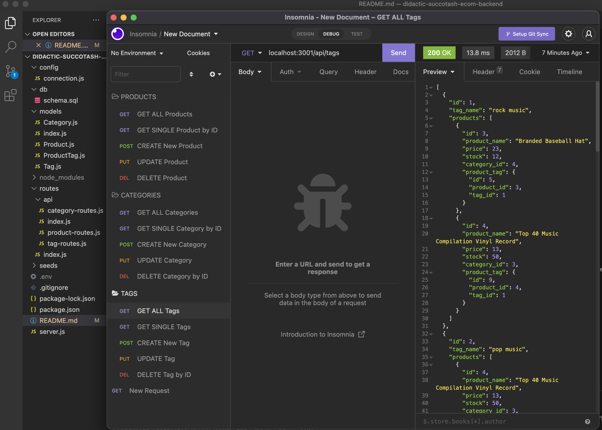

# didactic-succotash-ecom-backend

# E-Commerce Back End
  
  
  ## Table of Contents ##
  *[Description](#description)

  *[License](#license)

  *[Languages](#languages)

  *[Installation](#installation)

  *[Usage](#usage)

  *[Contributing](#contributing)

  *[Questions](#questions)

## LINK TO WALKTHROUGH VIDEOS ##

First video was longer than 5 minutes, so the rest is on the 2nd.

Part 1: https://drive.google.com/file/d/1dstNTs4jKWket_3K_esXAM7TNVYxnXSy/view

Part 2: https://drive.google.com/file/d/1sXHpCW6IgjkQA_17q0FYoq4ZEA57mJuv/view

  ## Description ##
  A back end application created to help developers understand the fundamental architecture of e-commerce sites by created routes that apply the CRUD method, using sql to create a database, and how to create and seed the database in order to see how they all work together to create a functioning back end site.
  

  ## License ##
  This is licensed under MIT
  

  ## Installation ##
  npm i

  ## Tests ##
  npm test

  ## Usage ##
  There's code in here!

  ## Contributing ##
  Make sure to create your own .env file and add it to your gitignore!

  ## Questions ##
  Github: [DEIVRS60](https://github.com/DEIVRS60)

  Email: david.reyes095@gmail.com

  
